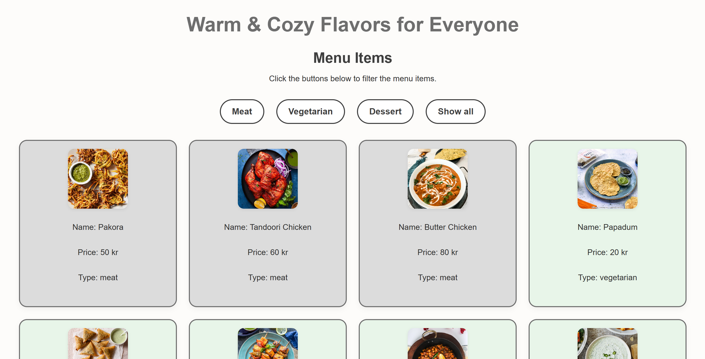

# ReDI School of Digital Integration - Interactive Menu solution

This is my solution to the **ReDI School of Digital Integration** challenge focused on building a restaurant menu layout, using semantic HTML and modern CSS techniques to create a visually appealing and accessible design.
The goal of this challenge was to build a clean and responsive restaurant menu. I focused on using **HTML5 semantic elements**, **CSS Flexbox** and **mobile-first design** principles. 
The project helped me reinforce structure, alignment, and spacing using modern layout systems. I made sure the text was legible, the content visually organized, and the experience user-friendly across different screen sizes.

## Table of Contents

- [Overview](#overview)  
  - [Screenshot](#screenshot)  
  - [Links](#links)  
- [My process](#my-process)  
  - [Built with](#built-with)  
  - [What I learned](#what-i-learned)  
  - [Continued development](#continued-development)  
  - [Useful resources](#useful-resources)  
- [Author](#author)  
- [Acknowledgments](#acknowledgments)

## Overview

### Screenshot

Here is a preview of my solution: 

### Links

- **Live Site URL on GitHub**: (https://paloma-cardozo.github.io/menu/)
- **Repository URL**: (https://github.com/Paloma-Cardozo/menu)

## My process

### Built with

- Semantic HTML5  
- CSS Flexbox  
- Mobile-first workflow  
- Git & GitHub Pages

### What I learned

Through this project, I learned the importance of **consistent padding, typography hierarchy, and visual balance**. 
I also practiced organizing content using HTML sections and styling lists in a clean, readable way. This was a great opportunity to continue improving my layout skills and strengthen my CSS confidence.

### Continued development

- Work more on responsive typography  
- Experiment with CSS Grid to improve layout structure  
- Keep improving color accessibility and contrast  
- Explore adding animations or transitions to make the UI feel more dynamic

### Useful resources

- [MDN Web Docs](https://developer.mozilla.org) – For reviewing HTML semantics and layout strategies  
- [CSS Tricks](https://css-tricks.com) – Especially helpful for flexbox tips and layout patterns  

## Author

- Frontend Mentor – [@Paloma-Cardozo](https://www.frontendmentor.io/profile/Paloma-Cardozo)
- GitHub URL – [Paloma-Cardozo](https://github.com/Paloma-Cardozo)

## Acknowledgments

My deepest thanks to my wonderful husband and daughter for being my biggest supporters through this learning journey. 
Their encouragement fuels every step I take toward a better version of myself. Also, a heartfelt thank you to **ReDI School** for guiding me into the world of tech and giving me the space to grow. 
